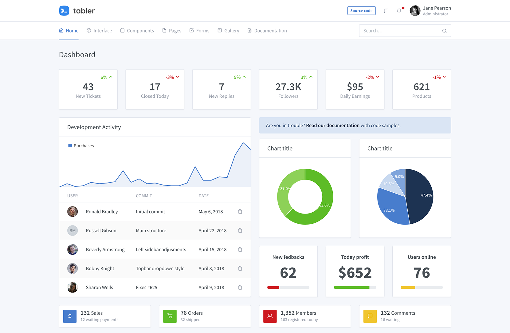

# l5-tabler



Tabler admin template for Laravel 5

## Installation

Run composer for installing package:

```bash
composer require "pingecom/l5-tabler":"~1.0.0"
```

Or add package name to require section:

```yaml
...
require: {
    ...
    "pingecom/l5-tabler":"~1.0.0"
    ...
}
...
```

If Laravel < 5.5, Add a provider to the list of providers in `config/app.php`

```php
...
"providers" => [
    ...
    '\Pingecom\Tabler\Providers\TablerServiceProvider',
    ...
]
...
```

Setup the middleware for menu by create a new middleware named: **DefineMenu**

You can read more at: https://github.com/lavary/laravel-menu

```php
<?php

namespace App\Http\Middleware;

use Closure;
use Lavary\Menu\Facade as Menu;

class DefineMenus
{
    public function handle($request, Closure $next)
    {
        Menu::make('primary', function ($menu) {
            $menu->add('Home');
            $menu->add('About', 'about');
            $menu->add('Services', 'services');
            $menu->add('Contact', 'contact');
        });

        return $next($request);
    }
}
```

Add a middleware to the middleware list

```php
protected $middlewareGroups = [
    'web' => [
        ...,
        \App\Http\Middleware\DefineMenus::class,
    ],
    ...
]
```

Publish all assets, views and others to continue.

```php
php artisan vendor:publish --provider="Pingecom\Tabler\Providers\TablerServiceProvider" 
```

## Usage

Create authentication pages

```php
php artisan make:tabler 
```

In your view, you can extends from layout
```blade
@extends('tabler::layouts.main')
@push('scripts')
@endpush
@push('styles')
@endpush
@section('content')
@stop
```
To use tabler plugins, such as: [charts](https://tabler.io/tabler/charts.html), [maps](https://tabler.io/tabler/maps.html). You can inject javascript and stylesheet to two [stacks](https://laravel.com/docs/5.7/blade#stacks)

```blade
@extends('tabler::layouts.main')
@push('scripts')
    <script src="{{ asset('admin/assets/plugins/charts-c3/plugin.js') }}"></script>
    <script type="text/javascript">
        require(['c3', 'jquery'], function (c3, $) {
            $(document).ready(function () {
    	        var chart = c3.generate({
    	            bindto: '#chart-employment',
    	            data: {
    		            ...
    		        }
    		    });
    	    });
        });
    </script>
@endpush
@push('styles')
    <link href="{{ asset('admin/assets/plugins/charts-c3/plugin.css') }}" rel="stylesheet"/>
@endpush

@section('content')
    <div class="my-3 my-md-5">
        <div class="container">
            <div class="page-header">
                <h1 class="page-title">
                    Charts
                </h1>
            </div>
            <div class="row row-cards">
                <div class="col-lg-6 col-xl-4">
                    <div class="card">
                        <div class="card-header">
                            <h3 class="card-title">Employment Growth</h3>
                        </div>
                        <div class="card-body">
                            <div id="chart-employment" style="height: 16rem"></div>
                        </div>
                    </div>
                </div>
            </div>
        </div>
    </div>
@stop	
``` 

## Customization

Open `tabler.php` in `config/tabler.php`, you can customize some URL, logo, suffix

```php
return [
    'suffix' => 'Tabler',
    'logo' => 'https://tabler.github.io/tabler/demo/brand/tabler.svg',
    'urls' => [
        'logout' => 'logout',
        'profile' => 'profile',
        'settings' => 'settings',
        'search' => 'search',
        'homepage' => '/',
        'login' => 'login',
        'post-login' => 'login',
        'forgot' => 'password/reset',
        'register' => 'register',
        'post-register' => 'register',
        'post-email' => 'password/email',
        'post-reset' => 'password/reset'
    ],
    'footer' => 'Copyright © 2018 Tabler. Theme by codecalm.net All rights reserved.',
    'support' => [
        'search' => false,
        'footer-menu' => false,
    ]
];
```
Customize views, open `resources/views/vendor/tabler` to customize
Customize assets, open `public/admin/assets`

## Documentation

For full documentation, visit [tabler.github.io/tabler/docs](https://tabler.github.io/tabler/docs/index.html).

## LICENSE

This project is licensed under the [MIT License](LICENSE).

## Issues

If you have any issue, please [create new issue](https://github.com/roanvanbao/l5-tabler/issues/new)

## Contributors

## Todo
